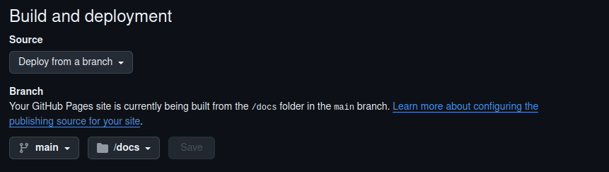
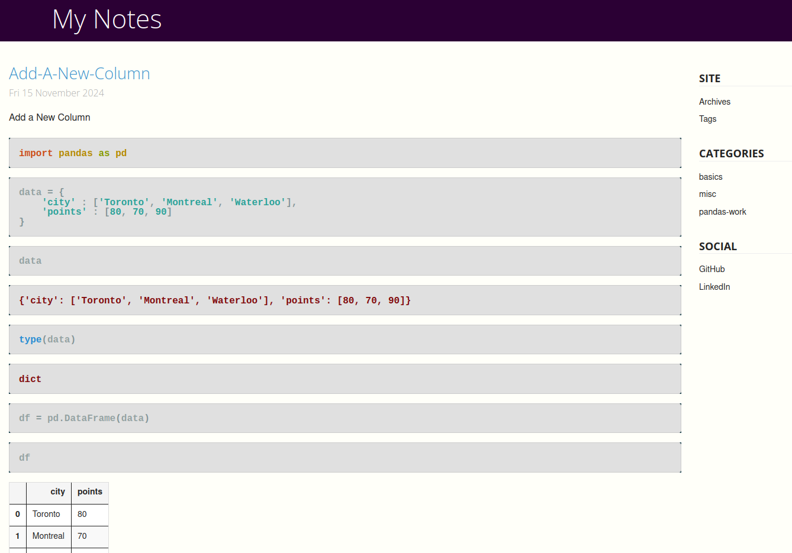
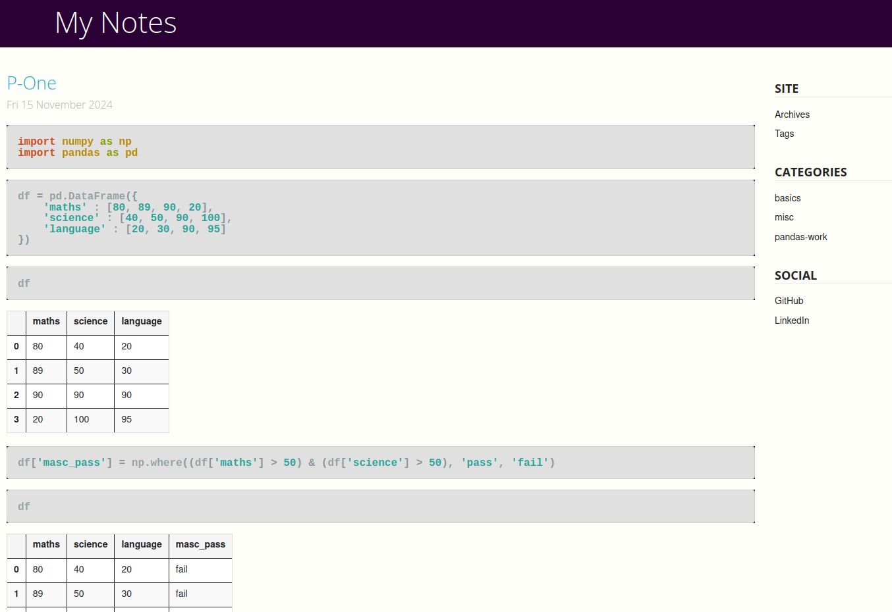
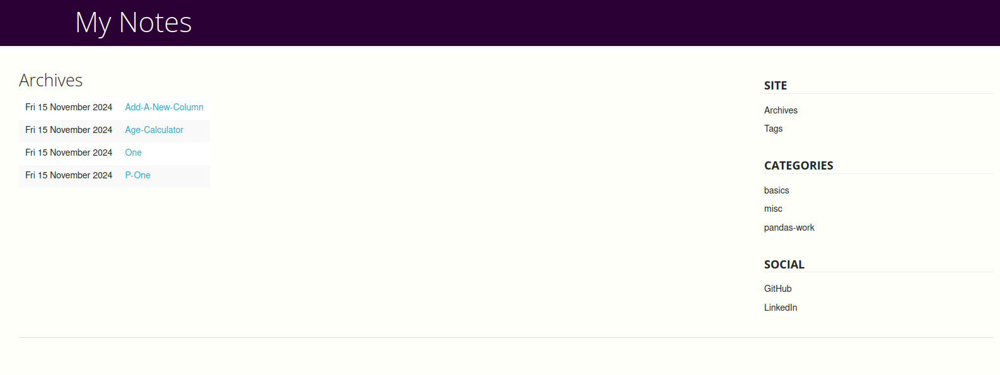

## SigPy
### Site Generator Python


### RJ Setup
```
ml311
```

### One time setup
```
1. Go to this
    https://github.com/tactlabs/sigpy

2. Use this template and create a new repository

3. run this
    pip install -r requirements.txt

4. Start adding new notebooks under `notebooks` folder

5. run this
    python make.py

    or

    # for recreating all files
    python make.py fresh

```

### Change Settings
```
go to pelicanconf.py

change the necessary changes to update:
    AUTHOR
    SITENAME
    GITHUB_USERNAME
    LINKS
    SOCIAL
```

### Verify Local
```
pelican content local

PELICAN_ENV=local pelican content
    this will run the local server
    http://127.0.0.1:8000
```

### Publish
```
pelican content

go to GitHub -> Pages -> Source

select "Deploy from  branch"

Go to branch on the same page

select "main" branch and "docs" folder
```



### Screenshots






