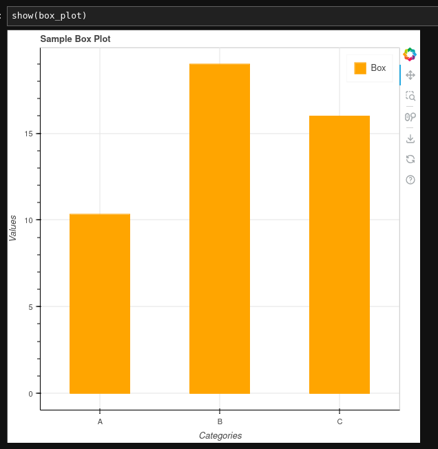

```python

```


```python
from bokeh.plotting import figure, output_file, show
from bokeh.io import output_notebook
from bokeh.models import ColumnDataSource
```


```python
# Set Bokeh output to notebook
output_notebook()
```


<style>
    .bk-notebook-logo {
        display: block;
        width: 20px;
        height: 20px;
        background-image: url(data:image/png;base64,iVBORw0KGgoAAAANSUhEUgAAABQAAAAUCAYAAACNiR0NAAAABHNCSVQICAgIfAhkiAAAAAlwSFlzAAALEgAACxIB0t1+/AAAABx0RVh0U29mdHdhcmUAQWRvYmUgRmlyZXdvcmtzIENTNui8sowAAAOkSURBVDiNjZRtaJVlGMd/1/08zzln5zjP1LWcU9N0NkN8m2CYjpgQYQXqSs0I84OLIC0hkEKoPtiH3gmKoiJDU7QpLgoLjLIQCpEsNJ1vqUOdO7ppbuec5+V+rj4ctwzd8IIbbi6u+8f1539dt3A78eXC7QizUF7gyV1fD1Yqg4JWz84yffhm0qkFqBogB9rM8tZdtwVsPUhWhGcFJngGeWrPzHm5oaMmkfEg1usvLFyc8jLRqDOMru7AyC8saQr7GG7f5fvDeH7Ej8CM66nIF+8yngt6HWaKh7k49Soy9nXurCi1o3qUbS3zWfrYeQDTB/Qj6kX6Ybhw4B+bOYoLKCC9H3Nu/leUTZ1JdRWkkn2ldcCamzrcf47KKXdAJllSlxAOkRgyHsGC/zRday5Qld9DyoM4/q/rUoy/CXh3jzOu3bHUVZeU+DEn8FInkPBFlu3+nW3Nw0mk6vCDiWg8CeJaxEwuHS3+z5RgY+YBR6V1Z1nxSOfoaPa4LASWxxdNp+VWTk7+4vzaou8v8PN+xo+KY2xsw6une2frhw05CTYOmQvsEhjhWjn0bmXPjpE1+kplmmkP3suftwTubK9Vq22qKmrBhpY4jvd5afdRA3wGjFAgcnTK2s4hY0/GPNIb0nErGMCRxWOOX64Z8RAC4oCXdklmEvcL8o0BfkNK4lUg9HTl+oPlQxdNo3Mg4Nv175e/1LDGzZen30MEjRUtmXSfiTVu1kK8W4txyV6BMKlbgk3lMwYCiusNy9fVfvvwMxv8Ynl6vxoByANLTWplvuj/nF9m2+PDtt1eiHPBr1oIfhCChQMBw6Aw0UulqTKZdfVvfG7VcfIqLG9bcldL/+pdWTLxLUy8Qq38heUIjh4XlzZxzQm19lLFlr8vdQ97rjZVOLf8nclzckbcD4wxXMidpX30sFd37Fv/GtwwhzhxGVAprjbg0gCAEeIgwCZyTV2Z1REEW8O4py0wsjeloKoMr6iCY6dP92H6Vw/oTyICIthibxjm/DfN9lVz8IqtqKYLUXfoKVMVQVVJOElGjrnnUt9T9wbgp8AyYKaGlqingHZU/uG2NTZSVqwHQTWkx9hxjkpWDaCg6Ckj5qebgBVbT3V3NNXMSiWSDdGV3hrtzla7J+duwPOToIg42ChPQOQjspnSlp1V+Gjdged7+8UN5CRAV7a5EdFNwCjEaBR27b3W890TE7g24NAP/mMDXRWrGoFPQI9ls/MWO2dWFAar/xcOIImbbpA3zgAAAABJRU5ErkJggg==);
    }
</style>
<div>
    <a href="https://bokeh.org" target="_blank" class="bk-notebook-logo"></a>
    <span id="c28bc359-cfaf-41d2-9d7a-896c04c741be">Loading BokehJS ...</span>
</div>


```python
import pandas as pd
```


```python
box_data = pd.DataFrame({'categories': ['A', 'B', 'C'], 'values': [[10, 12, 9], [20, 19, 18], [15, 17, 16]]})
box_plot = figure(x_range=box_data['categories'], title="Sample Box Plot", x_axis_label='Categories', y_axis_label='Values')
box_plot.vbar(x=box_data['categories'], top=[pd.Series(v).mean() for v in box_data['values']], width=0.5, color='orange', legend_label="Box")
```


<div style="display: table;"><div style="display: table-row;"><div style="display: table-cell;"><b title="bokeh.models.renderers.glyph_renderer.GlyphRenderer">GlyphRenderer</b>(</div><div style="display: table-cell;">id&nbsp;=&nbsp;'p1043', <span id="p1049" style="cursor: pointer;">&hellip;)</span></div></div><div class="p1048" style="display: none;"><div style="display: table-cell;"></div><div style="display: table-cell;">context_menu&nbsp;=&nbsp;None,</div></div><div class="p1048" style="display: none;"><div style="display: table-cell;"></div><div style="display: table-cell;">coordinates&nbsp;=&nbsp;None,</div></div><div class="p1048" style="display: none;"><div style="display: table-cell;"></div><div style="display: table-cell;">css_classes&nbsp;=&nbsp;[],</div></div><div class="p1048" style="display: none;"><div style="display: table-cell;"></div><div style="display: table-cell;">css_variables&nbsp;=&nbsp;{},</div></div><div class="p1048" style="display: none;"><div style="display: table-cell;"></div><div style="display: table-cell;">data_source&nbsp;=&nbsp;ColumnDataSource(id='p1037', ...),</div></div><div class="p1048" style="display: none;"><div style="display: table-cell;"></div><div style="display: table-cell;">glyph&nbsp;=&nbsp;VBar(id='p1040', ...),</div></div><div class="p1048" style="display: none;"><div style="display: table-cell;"></div><div style="display: table-cell;">group&nbsp;=&nbsp;None,</div></div><div class="p1048" style="display: none;"><div style="display: table-cell;"></div><div style="display: table-cell;">hover_glyph&nbsp;=&nbsp;None,</div></div><div class="p1048" style="display: none;"><div style="display: table-cell;"></div><div style="display: table-cell;">js_event_callbacks&nbsp;=&nbsp;{},</div></div><div class="p1048" style="display: none;"><div style="display: table-cell;"></div><div style="display: table-cell;">js_property_callbacks&nbsp;=&nbsp;{},</div></div><div class="p1048" style="display: none;"><div style="display: table-cell;"></div><div style="display: table-cell;">level&nbsp;=&nbsp;'glyph',</div></div><div class="p1048" style="display: none;"><div style="display: table-cell;"></div><div style="display: table-cell;">muted&nbsp;=&nbsp;False,</div></div><div class="p1048" style="display: none;"><div style="display: table-cell;"></div><div style="display: table-cell;">muted_glyph&nbsp;=&nbsp;VBar(id='p1042', ...),</div></div><div class="p1048" style="display: none;"><div style="display: table-cell;"></div><div style="display: table-cell;">name&nbsp;=&nbsp;None,</div></div><div class="p1048" style="display: none;"><div style="display: table-cell;"></div><div style="display: table-cell;">nonselection_glyph&nbsp;=&nbsp;VBar(id='p1041', ...),</div></div><div class="p1048" style="display: none;"><div style="display: table-cell;"></div><div style="display: table-cell;">propagate_hover&nbsp;=&nbsp;False,</div></div><div class="p1048" style="display: none;"><div style="display: table-cell;"></div><div style="display: table-cell;">selection_glyph&nbsp;=&nbsp;'auto',</div></div><div class="p1048" style="display: none;"><div style="display: table-cell;"></div><div style="display: table-cell;">styles&nbsp;=&nbsp;{},</div></div><div class="p1048" style="display: none;"><div style="display: table-cell;"></div><div style="display: table-cell;">stylesheets&nbsp;=&nbsp;[],</div></div><div class="p1048" style="display: none;"><div style="display: table-cell;"></div><div style="display: table-cell;">subscribed_events&nbsp;=&nbsp;PropertyValueSet(),</div></div><div class="p1048" style="display: none;"><div style="display: table-cell;"></div><div style="display: table-cell;">syncable&nbsp;=&nbsp;True,</div></div><div class="p1048" style="display: none;"><div style="display: table-cell;"></div><div style="display: table-cell;">tags&nbsp;=&nbsp;[],</div></div><div class="p1048" style="display: none;"><div style="display: table-cell;"></div><div style="display: table-cell;">view&nbsp;=&nbsp;CDSView(id='p1044', ...),</div></div><div class="p1048" style="display: none;"><div style="display: table-cell;"></div><div style="display: table-cell;">visible&nbsp;=&nbsp;True,</div></div><div class="p1048" style="display: none;"><div style="display: table-cell;"></div><div style="display: table-cell;">x_range_name&nbsp;=&nbsp;'default',</div></div><div class="p1048" style="display: none;"><div style="display: table-cell;"></div><div style="display: table-cell;">y_range_name&nbsp;=&nbsp;'default')</div></div></div>
<script>
(function() {
  let expanded = false;
  const ellipsis = document.getElementById("p1049");
  ellipsis.addEventListener("click", function() {
    const rows = document.getElementsByClassName("p1048");
    for (let i = 0; i < rows.length; i++) {
      const el = rows[i];
      el.style.display = expanded ? "none" : "table-row";
    }
    ellipsis.innerHTML = expanded ? "&hellip;)" : "&lsaquo;&lsaquo;&lsaquo;";
    expanded = !expanded;
  });
})();
</script>


```python
show(box_plot)
```


<div id="ddd411e6-cc03-48c1-9e90-f01a7390f1ad" data-root-id="p1001" style="display: contents;"></div>


Screenshot




```python

```


---
**Score: 5**