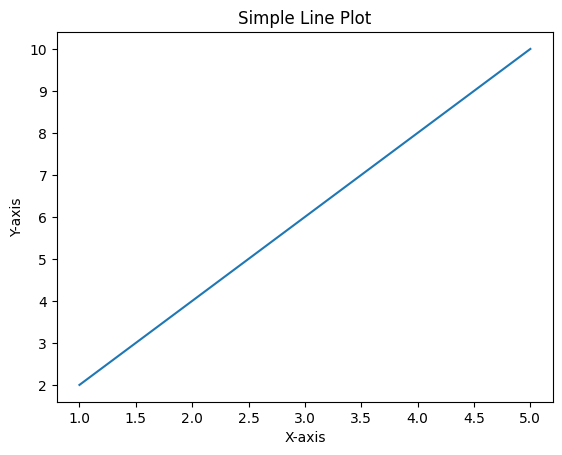

```python
import matplotlib.pyplot as plt

# Data
x = [1, 2, 3, 4, 5]
y = [2, 4, 6, 8, 10]

# Create a plot
plt.plot(x, y)

# Add labels and title
plt.xlabel('X-axis')
plt.ylabel('Y-axis')
plt.title('Simple Line Plot')

# Display the plot
plt.show()
```


    

    


```python

```
