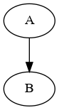

```python
from pydotplus import graphviz

# Example graph creation
graph = graphviz.Dot(graph_type='digraph')
node_a = graphviz.Node('A')
node_b = graphviz.Node('B')
graph.add_node(node_a)
graph.add_node(node_b)
graph.add_edge(graphviz.Edge(node_a, node_b))

# Save and visualize
graph.write_png("example_graph.png")
from IPython.display import Image
Image(graph.create_png())

```


    

    


```python

```
